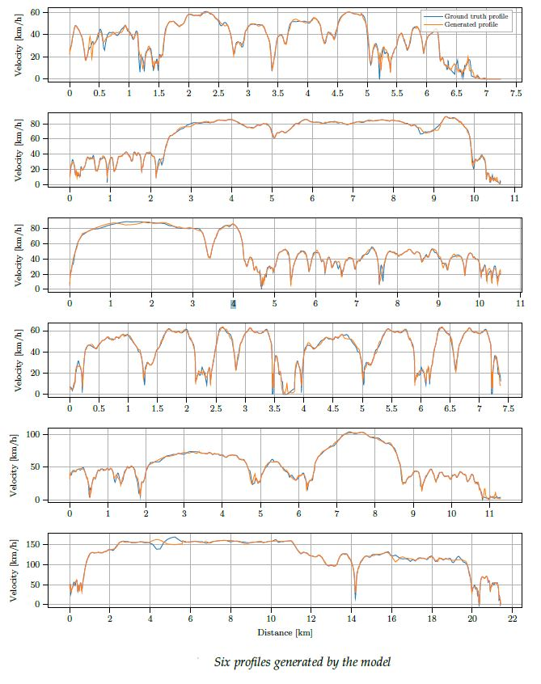

# SPGen
## A Two-Stage Deep Learning Based Approach for Predicting Instantaneous Vehicle Speed Profiles on Road Networks

Accurate prediction of vehicle speed profiles is crucial for various transportation and vehicular applications. However, this task poses challenges due to the complexity and uncertainty of the multiple factors influencing driver behavior. In our research, we propose an innovative data-driven model that addresses these challenges. Our model employs a deep two-stage long short-term memory (LSTM) architecture to effectively capture the intricate relationship between vehicle speed and macroscopic road attributes.

By integrating road features, which can be obtained from different online map services, and average speeds as inputs, our model generates naturalistic speed profiles for a given route. This approach leverages the power of LSTM, a type of recurrent neural network (RNN) capable of learning patterns from sequential data, to analyze and predict speed variations based on road characteristics.

The utilization of a data-driven approach and the incorporation of various road attributes make our model capable of producing accurate and contextually relevant speed predictions. 

the details of the model are described in our conference paper presented at the 26th IEEE International Conference on Intelligent Transportation Systems ITSC 2023:
**Dib.A, Sciarretta, A., Balac.M (2023). A Two-Stage Deep Learning Based Approach for Predicting Instantaneous Vehicle Speed Profiles on Road Networks. In Proceedings of the 26th IEEE International Conference on Intelligent Transportation Systems (ITSC 2023).**

## code
Please be aware that the code version provided here serves only as an illustrative example of our model and should not be considered the final version. If you require more detailed information or have any inquiries, please don't hesitate to contact us at abdelkader.dib@ifpen.fr. We would be pleased to provide you with further insights and assistance.

**ENCODER_MODEL** :  This file contains the first stage model.  
**GENERATOR_MODEL** :  This file contains the second stage model.  
**SPGen_model** : This file contains the whole model, the input can be in the form of pandas dataframe containing sequences of roads features and average speeds and the outputs are speed profiles.  
**Functions** : This file contains some functions that are used for training and for inference. The data pipeline aren't that efficient.  

## Data
Coming soon! A sample of our data will be published. For more details, contact us at abdelkader.dib@ifpen.fr.
